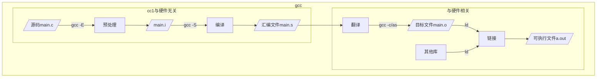
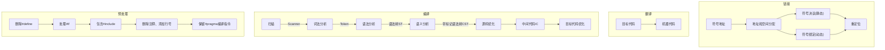

[toc]
---
# 序言
*笔者学过数据结构、算法等等计算机课程，工作后也长期写C业务代码，却从没从零写过一个完整的应用程序。四处搜集资料，深陷迷茫，苦难重重。本经验通过系统梳理，逐步形成完整流程，希望能给同在探索的同学一点帮助。全文通过Markdown语法[^foot1]编写，假设有最简单的程序基础。*
[^foot1]: Appendix A: 常用Markdown语法

硬通货使用常规字体，*心得体验（废话）使用斜体*，**加粗表示遇到的坑**
# 介绍
* 完成构建系统
从写一个hello world小程序开始，借助make进行编译，扩展hello world程序到多个文件和文件夹，使用cmake进行编译，运用gtest框架实现测试驱动开发，借用github的action流水线持续构建，使用rtf编写github首页README.md等等，像专业程序员发布自己的代码。如下图[^foot2]

    ```mermaid
    graph LR
        A[hello world] -->gcc-->make-->cmake-->GTest--> B[Github Action]
    ```
* *当前环境：*
    * PC系统：macOs Ventura 13.0.1
    * IDE: Visual Studio Code
    * 源码管理：git 2.37.1
    * gcc: Apple clang version 14.0.0

# Hello World程序
任何一个程序的入口为`main()`
```[C]
// src/main.c
#include <stdio.h>

#define SUCCESS 0
int main() 
{
    printf("hello world!\n");
    return SUCCESS;
}
```
---
## gcc
使用`gcc src/main.c;a.out`，即可看到结果，在src同级目录下，可以看到`a.out`，这是一个简单的应用程序。gcc分解步骤如下图，详细可以参考[程序员的自我修养--链接、装载与库笔记：编译和链接，蒲公英云](https://css.dandelioncloud.cn/article/details/1499054960229818370)。




编译和翻译过程是最为复杂的：
* **语法分析**：生成以表达式为节点的树(Syntsx Tree, ST)，校验括号不匹配、缺少操作符等。

* **语义分析**：生成带标记的语法树(Commented ST, CST)，静态语义分析，检查声明和类型的匹配、类型的转换，补充隐式转换节点。

* **源码优化**：将CST转换为中间代码(Intermediate Code, IC)，是CST的顺序表示，属于编译器前端，与机器无关。

* **目标代码生成与优化**：将中间代码转换为目标机器代码，并使用目标代码优化器进行优化，如寻址方式、位移代替乘除、删除多余指令，属于编译器后端，十分依赖目标机器。

链接器比编译器出现的更早，随着程序的扩大，被分割成多个模块之后，需要依赖符号进行模块间信息交互。简言之是对符号地址的替换重定位。

---
## make
随着代码逐渐复杂，将所有代码存放在一个.c文件中，显然会造成阅读困难。代码逐渐出现模块分层的概念，拆分模块文件势在必行。如上文的hello world，我们将其扩充成来访登记系统，一个负责用户信息存储，一个文件负责控制整体输入流程，其文件结构如下
```
cshares
├── include
│   ├── user.h  // user模块的对外头文件
│   └── util.h  // 公共声明的对外头文件
└── src
    ├── main.c  // 程序main入口
    └── user
        ├── user_record.c   // 用户登陆，用户名校验等
        └── user_record.h   // 暂时为空的头文件
```

此时执行如下的一长串命令进行编译：
```[bash]
gcc src/main.c src/user/user_record.c src/user/user_record.h include/util.h include/user.h
```
则会报错，提示`main.c`中，无法找到包含的`user.h`：
```[bash]
src/main.c:4:10: fatal error: 'user.h' file not found
#include "user.h"
         ^~~~~~~~
```
如果采用相对路径include，则可以通过编译，但相对路径存在变化的情况，且不美观。
```[c]
#include "../include/user.h"
```
此时需要一款强大的工具帮助我们解决这些问题，实现“自动化编译”——`make`。`make`使用程序默认读取当前目录下的`Makefile`，`Makefile`由一系列规则组成，并描述各个文件之间的依赖关系。
`Makefile`规则编写的格式是：
```[make]
<目标> : <前置文件> 
[tab]  <commands>
```
* **目标**优先将字符串识别为文件，如果不存在文件，则仅作为目标名称，执行后续动作
    * 目标文件：执行后得到的结果文件
    * 伪目标：后跟动作，常见的如`clean`
    ```
    .PHONY: clean
    clean:
        rm *.o tmp 
    ```
* **前置文件**：可选，存在时，如果前置文件不存在或被更新，则目标也进行更新。

`make`的执行规则是：
```
make
make 目标
```
# Appendix A：Markdown语法
Markdown是纯文本格式的语言，可以通过简单的标记语法，使普通文本内容具有一定的格式，语法简单，快速上手。*相比markdown，我更喜欢latex。latex文件虽然本身也是纯文本格式，但需要依赖textlive等厚重的“编译器”才能结果可视，且语法相对复杂，感性趣的同学可以自学*。

1. 各类字体：
    ```
    # 一级标题
    ## 二级标题
    ...
    ###### 六级标题

    *被加粗的文本*，
    **斜体文本**
    ***斜体加粗文本***

       ```[代码语言]
       代码段
       ```
    行内变量名使用单引号括起来`变量名`

    水平分割线
    —--

    ```
2. 链接
    * 脚注链接
        ```[markdown]
        [^tag]
        [^tag]: 脚注内容
        ```
    * 图片只能以链接形式添加：
        ```[markdown]
        
        ```
    * 超链接
        ```[markdown]
        [显示文字](链接)
        ```

## Appendix A.1 mermaid - 使用Markdown生成语法图
[^foot2]: Appendix A.1: mermaid - 使用Markdown生成语法图

```[]
    ```mermaid
    图类型 补充说明
    tag[value]->value->tag{value}
    ```
```
其中
图类型|补充说明|
:---:|:---|
流程图`graph`| 方向默认`TD`，`BT`，`RL`，`LR`|
图标形状`[value]`| 矩形`[`，圆角矩形`(`，椭圆形`([`，圆形`((`，圆柱形`[(`，平行四边形`[/`｜
线条 | 实线`--`，粗线`==`，虚线`-.-`，加长`---`｜
线条说明| 说明`--说明--`，加深说明`--> |说明|`|
箭头|无箭头，尖头`>`，圆头`o`，x头`x`｜
标签组合`tag`| 多标签`A --> B`，`A-->C`｜
特殊字符html|"`#quot;`，$`#36;`|


